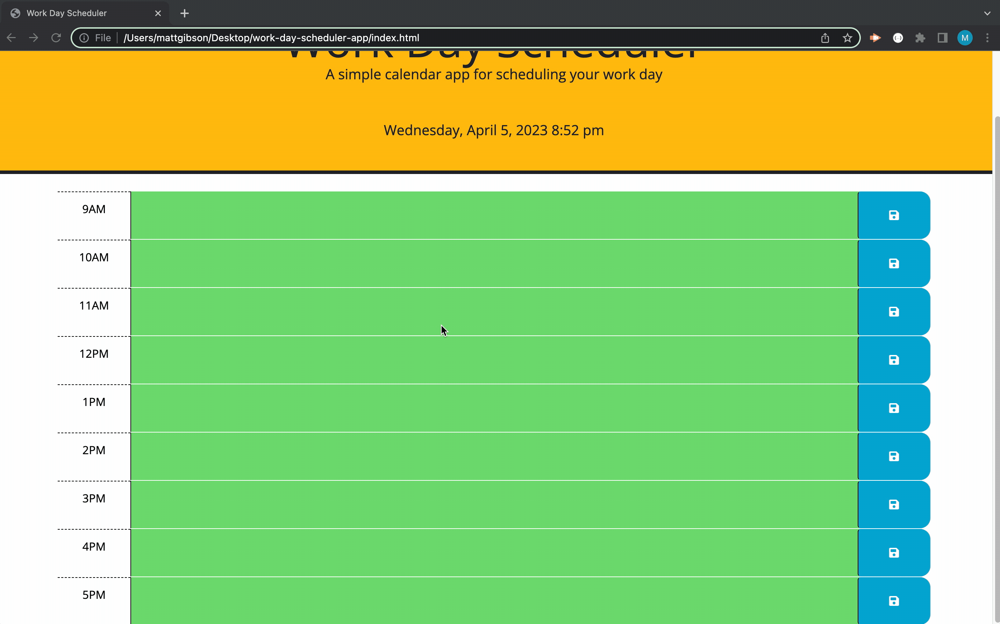

# work-day-scheduler-app

work day scheduler app

## Visit the Site

[Cleck Here to Visit the Deployed Site](https://ohsweetwampum.github.io/work-day-scheduler-app/)

## Description

This app has 24 time blocks, one for every hour of the day. In each hour block you can enter text to describe what task(s) you need to do at that particular time of the day. You can save your tasks by clicking the floppy disk icon and come back to the page whenever you need to and your tasks will still be there.The grey boxes indicate tasks that are past due, the red box is the task that you need to do at the moment, and the green boxes are tasks that you'll need to do in the future. At the top of the page there is displayed the current date and time, which you can reference to if needed.

## Technology Used

- Bootstrap
  [Learn about Bootstrap](https://getbootstrap.com/)

- Day.js
  [Learn about Day.js](https://day.js.org/)

- jQuery
  [Learn about jQuery](https://jquery.com/)

- JavaScript
  [Learn about JavaScript](https://developer.mozilla.org/en-US/docs/Web/JavaScript)

- HTML
  [Learn about HTML](https://developer.mozilla.org/en-US/docs/Web/HTML)

- CSS
  [Learn about CSS](https://developer.mozilla.org/en-US/docs/Web/CSS)

- Git
  [Learn about Git](https://git-scm.com/)

## Usage

1. Choose a time block to put your task in, use mouse to click the text input area and type in your to-dos
2. Click the save buton, which is a floppy disk icon to save your to-do



## Code Highlight

I wanted to highlight this code snippet because storing user data is very inportant if you want certain features available to the user. I used the keyword "this". var taskText gets the value of the input field with class 'description' that is a sibling of the clicked button. var taskTime gets the text of the element with class 'hour' that is a sibling of the clicked button. then finally, the last line tells to store to local storage with key of taskTime and value of taskText.

```JavaScript
function storeToLocal() {
  $(".saveBtn").on("click", function () {
    var taskText = $(this).siblings(".description").val();
    var taskTime = $(this).siblings(".hour").text();
    localStorage.setItem(taskTime, taskText);
  });
}
```

## Learning Points

- Furthered knowledge of local storage, saving and retrieving
- Learned how to use jQuery
- Learned how to use bootstrap
- Learned how to us day.js
- Learned how to apply CSS classes when certain criteria are met

## Author Info

Matthew Gibson

- [Portfolio](https://github.com/ohSweetWampum)
- [LinkedIn](https://www.linkedin.com/in/matthew-gibson-6b9b12237/)
- [Github](https://github.com/ohSweetWampum)

## Credits

[meyerweb.com](https://meyerweb.com/eric/tools/css/reset/)
(For my reset.css file)

[w3schools.com](https://www.w3schools.com/jquery/html_addclass.asp)
(addClass() method)

[day.js.org](https://day.js.org/)
(Day.js documents)

[jQuery.com](https://jquery.com/)
(jQuery Documents)

## License

[](https://opensource.org/licenses/MIT)

---

```

```
